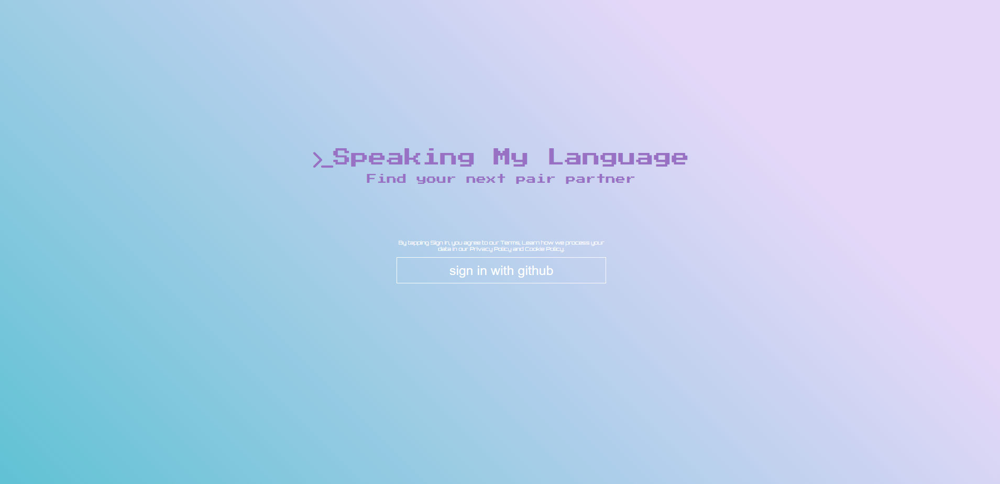
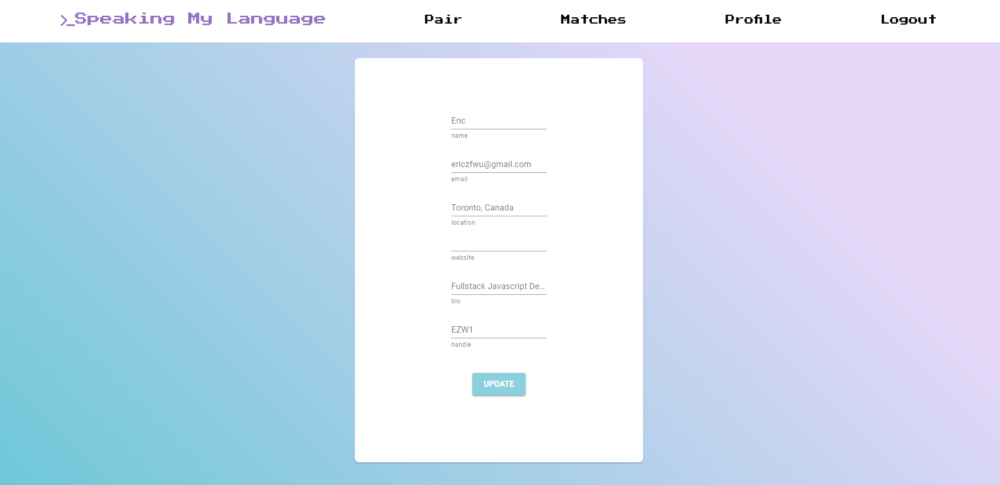

<p align="center">

</p>

# Speak My Language

An open source platform for connecting software engineers interested in pair programming, based on overlapping skills.

## How to get started?

1. Fork and clone the repo.
1. Then add a .env file to your root directory with the following
   - You will need a Github Secret ID and Client ID for Github's OAuth
   - You will also need a link to PostgreSQL database
   ```
   GITHUB_CLIENT_ID =
   GITHUB_SECRET_ID =
   PG_URL = 
   ```
1. Then `npm install && npm run dev` to get started
1. To build for production run `npm run build && npm start`

## Want to Contribute?

1. Clone the repo and make a new branch
1. Add a feature, fix a bug, or refactor some code :)
1. Make sure to lint your code!
1. Write/update tests for the changes you made, if necessary.
1. Run unit & integration tests and make sure all tests pass: npm test.
1. Open a Pull Request with a comprehensive description of changes to the dev branch

## Technologies

- React
- React Router
- Node
- Express
- OAuth
- PostgreSQL
- ReCharts
- Jest
- React Testing Library
- Puppeteer
- Webpack

## Screenshots

Login by connecting securely through Github

<p align="center">

</p>

Filter through the list of current users, give them a 1 or 0

<p align="center">

</p>

Edit your profile

<p align="center">

</p>
